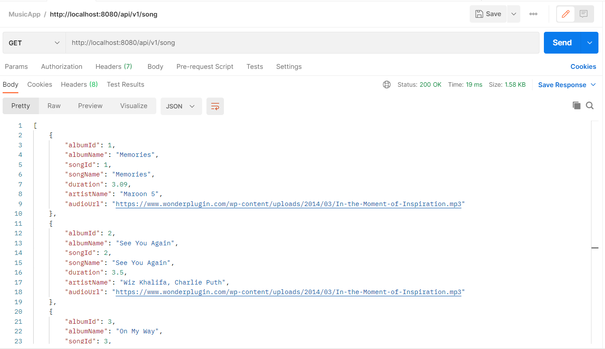
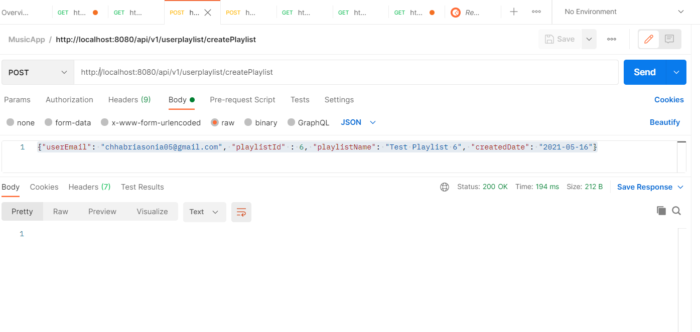
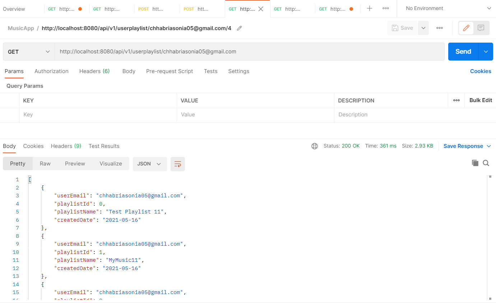
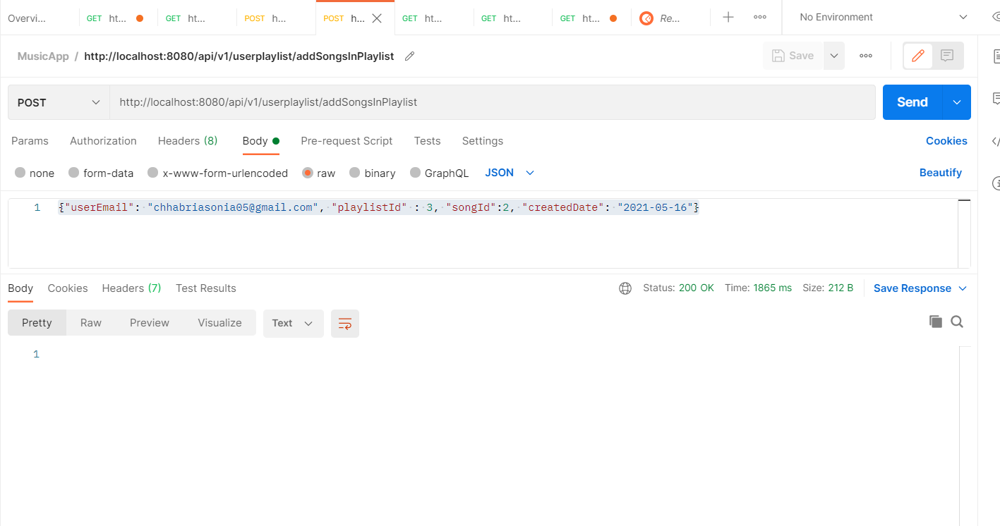
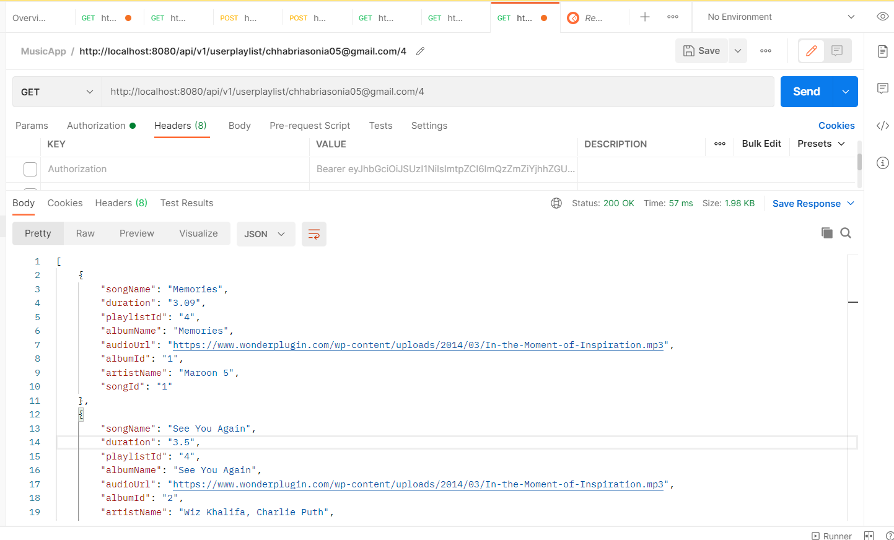
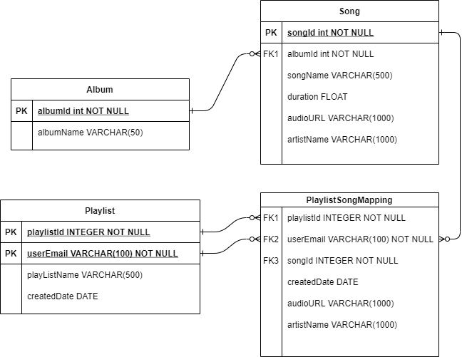

[](https://music-webapp-sc.herokuapp.com/)
# Music App

## Technology Stack:
- Front-end: React JS
- Service layer: Spring Boot Java Application
- Database: SQLite

## Features

- Search functionality which allows users to serach from the list of songs available
- Allows users to create playlist and add songs to it
- Integration of Google Sign-In to perform Session management

## Pre-requisite 
- [Java 1.9+](http://www.oracle.com/technetwork/java/javase/downloads/index.html)  
- [Spring Boot](https://spring.io/tools/sts/all) 
-- Create a new project with Spring Web dependencies, download the template and extract the files
- [Node](https://nodejs.org/en/download/)
- [SQLite](https://www.sqlite.org/download.html) 
- IDE/Editor:
-- VS Code
-- Eclipse for Java Developers


## Steps to execute solution on local
1. Clone Repository from [here](https://github.com/SoniaChhabria/music-app.git)
2. Open FrontEnd folder in VS Code
2.1 For updating Client ID in Login.js and Logout.js files, perform the following steps:
-- Navigate to [Google Cloud](https://console.cloud.google.com/)
-- Create a New Project and navigate to API & Services tab
-- Create app registration from OAuth consent screen
-- Under Credentials tab, create credential and select OAuth Cleint ID. Add Authorized JavaScript origins (e.g. http://localhost:3000) and Authorised redirect URIs (e.g. http://localhost:3000 and http://localhost:3000/login/oauth2/code/google)
2.2 Run the following command, from the application folder and execute following commands to install dependencies
```
$ npm install
$ npm run start
```
3. Open Java folder in Eclipse for Java Developers 
3.1 Navigate to src/main/java/com/example/musicapp/MusicAppApplication.java and run the file as Java Application. It will take some time for the first time to install dependencies. Expected output is service is ready and running at http://localhost:8080/

## List of APIs

Route | Method |Body/Parameter | Sample Response | Description |
|---|---|---|---|---|
|api/v1/song |list | NA |  | Used to get list of Songs from SQLite Database |
|api/v1/userplaylist/ |createPlaylist | {"userEmail": "chhabriasonia05@gmail.com", "playlistId" : 6, "playlistName": "Test Playlist 6", "createdDate": "2021-05-16"} |  | Creates playlist for logged-in user  |
|api/v1/userplaylist/ |getPlaylist | userEmail || Used to get playlist created by logged-in user |
|api/v1/userplaylist/ |addSongsInPlaylist | {"userEmail": "chhabriasonia05@gmail.com", "playlistId" : 3, "songId":2, "createdDate": "2021-05-16"} |  | Used to add songs in playlist |
|api/v1/userplaylist/ |getSongsInPlaylist | playlistId, userEmail |  | Used to get songs in playlist for logged-in user |


## Database Schema
